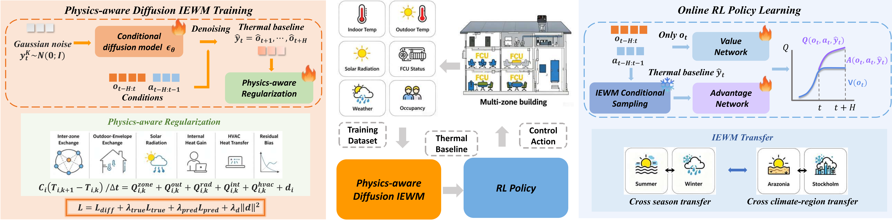

# ADAPT
Code for paper ADAPT


<p align="center">
  
</p>

<p align="center">
  <em>Figure 1: Overview of the proposed ADAPT framework.</em>
</p>

## Installation

### 1. Clone the repository

```bash
git clone https://github.com/xuyangthu88/ADAPT.git
cd ADAPT
```

### 2. Create conda environment

```bash
conda create -n adapt python=3.10
conda activate adapt
```

### 3. Install dependencies

```bash
pip install -r requirements.txt
```
### 4. Editable install packages
```bash
pip install -e .  # install cleanrl
cd diffuser
pip install -e .  # install diffuser
```

### 5. (Optional) Install EnergyPlus

For Sinergym experiments, install EnergyPlus 23.1+ and set:

```bash
export ENERGYPLUS_HOME={your energyplus path}
export PATH=$ENERGYPLUS_HOME:$PATH
export PYTHONPATH=$ENERGYPLUS_HOME:$PYTHONPATH
export EPLUS_PATH={your energyplus path}
```

## Training

### Train the physics-aware diffusion IEWM

```bash
python scripts/train.py
```

### Train RL with the world model

```bash
python adapt.py \
  --forecast_checkpoint ${ckpt_path}
  --forecast_config ${config_path}
  --forecast_model_type "DiffusionWM"
```

